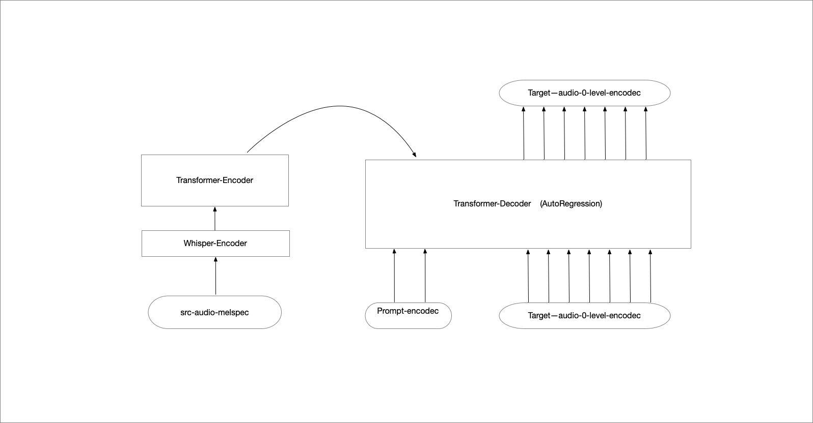
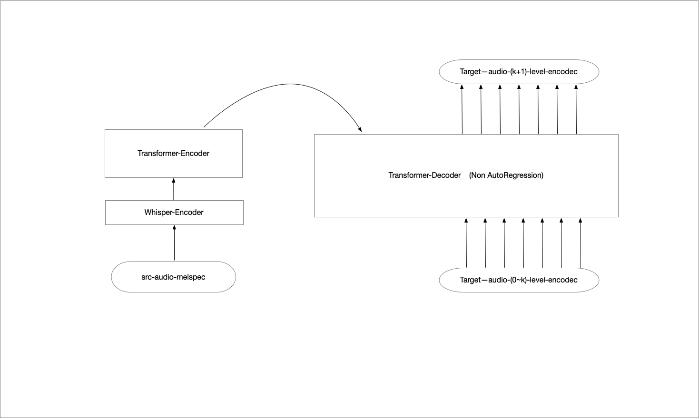

# vc-lm
[**中文**](./README.md) | [**English**](./README_en.md)

vc-lm是一个可以将任意人的音色转换为成千上万种不同音色的音频的项目。

## 算法架构
该项目参考论文 [Vall-E](https://arxiv.org/abs/2301.02111)

使用[encodec](https://github.com/facebookresearch/encodec),
将音频离散化成tokens, 在tokens上构建transformer语言模型。
该项目包含两阶段模型 AR模型和NAR模型。

输入: 3s音色prompt音频 + 被转换音频

输出: 转换后音频

在训练阶段，采用了自监督的方式，其中源音频和目标音频是相同的。
### AR阶段
输入: prompt音频 + 源音频

输出: 目标音频 0 level tokens



### NAR阶段
输入: 目标音频(0~k)level tokens

输出: 目标音频k+1 level tokens



## 构造数据集

```
python tools/construct_dataset.py
```
## 转换whisper encoder模型

```
python tools/extract_whisper_encoder_model.py --input_model=../whisper/small.pt --output_model=../whisper-encoder/small-encoder.pt
```
## 训练
```
bash ./sh/train_ar_model.sh
bash ./sh/train_nar_model.sh
```
## 推理
```
from vc_lm.vc_engine import VCEngine
engine = VCEngine('/root/autodl-tmp/vc-models/ar.ckpt',
                  '/root/autodl-tmp/vc-models/nar.ckpt',
                  '/root/project/vc-lm/configs/ar_model.json',
                  '/root/project/vc-lm/configs/nar_model.json')
output_wav = engine.process_audio(content_wav,
                                  style_wav, max_style_len=3, use_ar=True)           
```

## 模型
模型是在Wenetspeech数千小时音频数据集上进行训练得到，包括AR模型和NAR模型。

模型下载地址:

链接: https://pan.baidu.com/s/1bJUXrSH7tJ1QLPTv3tZzRQ 提取码: 4kao

## 样例展示
[输入音频](res/test-in.wav)

[输出音频1](res/o1.wav)

[输出音频2](res/o2.wav)

[输出音频3](res/o3.wav)

[输出音频4](res/o4.wav)

[输出音频5](res/o5.wav)

---
```
本项目模型可以生成大量one-to-any的平行数据(也就是any-to-one)。这些平行数据可以被用来训练 Any-to-One 的变声模型。
```